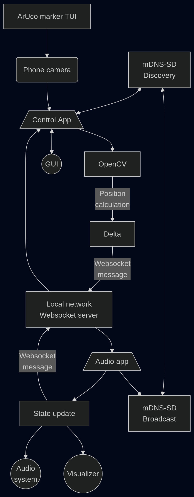
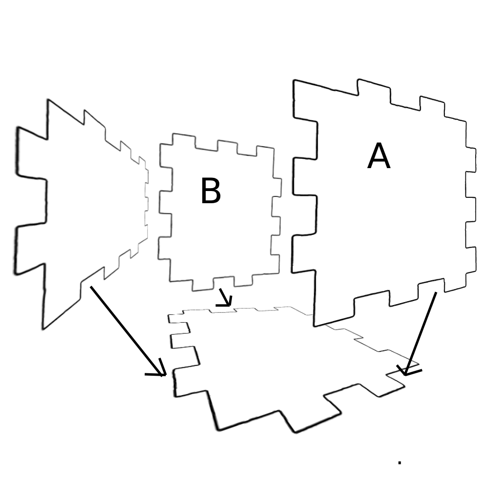

# Android Multi-Device Demo

This project is a demonstration of how to communicate with and control an app
from another app. Features the use of a novel OpenCV-based tangible user
interface (TUI), mDNS-SD for automatic device discovery and connection over
local network, websockets for inter-device messaging and rust-based android
development via the NDK.


## Purpose

This project can serve as a reference point for further experiments involving
any aspect of its implementation. It uses many new and lesser known tools to
inspire learning about these things and building new products based on them.

## Motivation

I like to play bass and write software. Electronics is an integral part of both
experimenting with bass tone and exploring different kinds of software and its
manipulation. DIY electronics can become expensive and involve a lot of tools
that require complex and sometimes dangerous setup. They can also be difficult
to prototype with. Additionally, the refurbished market for android phones now
includes very capable and cheap devices.

The hypothesis is, what if instead of building audio tools like DSPs,
interfaces, or synthesizers with electronics, we just use multiple android
devices?

I really like DIY and rapid prototyping my ideas. While struggling with
prototyping some novel interfaces using electronics, it occured to me that I
could use OpenCV as a kind of input system. By separating different
responsibilities over separate devices, we can also achieve more due to the
additional compute and not cramming multiple usage paradigms into a single app
on a single device.

Ultimately, I devised a starting point for articulating these ideas and
developing the distinct components as modules for further projects.

## Structure



## Components

### Audio App

The audio app's primary purpose is to output audio. Therefore, the design of it
is to be performant. Real-time audio processing is susceptible underruns when
there are latency issues. These underruns cause audible pops, which is
undesirable. To get the most out of android, we need to use oboe via the NDK,
and choose to run this app on whatever device we have that has the best chipset.

#### Rust and the NDK

Android's NDK allows native code to run directly on the device, bypassing the
JVM. This is necessary for oboe, which is a C++ library. The app is written
entirely in Rust and compiled to a shared library via `cargo-ndk`. It uses
`android-activity` with the `native-activity` feature, meaning the app bypasses
any Java activity and runs its main loop directly in native code. JNI is still
used where Android system APIs are unavailable from Rust, specifically for mDNS
registration.

#### Oboe

Oboe is Google's C++ audio library for Android. It selects the best available
audio backend (AAudio or OpenSL ES) depending on what the device supports. The
stream is opened with `PerformanceMode::LowLatency` and
`SharingMode::Exclusive`, giving the app sole use of the audio hardware. The
audio callback runs on a dedicated high-priority thread managed by Oboe. Inside
the callback, the engine synthesizes a sine wave sample-by-sample and writes it
into the output buffer.

#### Visualizer

The visualizer is an OpenGL ES 3.0 fullscreen shader rendered each frame in the
main loop. It draws an oscilloscope-style sine wave whose cycle density and
scroll speed reflect the current frequency value. The aesthetic resembles a
phosphor CRT display, with multiple glow layers and scanline darkening. Its role
is twofold: it provides visual feedback that the frequency is changing, and it
confirms the app is alive and rendering.

#### WebSocket Server

The WebSocket server runs on its own thread and listens on a TCP port assigned
by the OS. It implements the WebSocket handshake and framing from scratch with
no external library dependencies. Incoming messages are parsed for a `delta`
field; when found, the value is added to the current frequency and forwarded to
the audio engine via a channel. The updated frequency value is then broadcast
back to all connected clients as `{"value": <freq>}`.

#### mDNS-SD Broadcast

Once the WebSocket server is bound and reports its port, the audio app registers
that port as an mDNS service named `AudioAppWS` over `_http._tcp.`. This is done
through a Java helper class (`NsdHelper`) called via JNI, since Android's
`NsdManager` API is only accessible from Java. The registration makes the server
automatically discoverable on the local network without any manual IP
configuration.

### Control App

The control app provides an interface layer to the audio system. It is so
decoupled from the audio system, that it lives on an entirely separate android
device. As this isn't performance critical, we can afford to build this app
using Cordova. Using Cordova means we can build apps using web technology, while
also leveraging native capabilities through plugins that bridge to JavaScript.

#### OpenCV.js

Each camera frame is processed by OpenCV.js running in the browser context. The
pipeline works as follows:

1. **ArUco detection** - the frame is scanned for ArUco markers from the
   `DICT_4X4_50` dictionary. Marker 23 is used as the anchor for the rotary
   control.
2. **Perspective warp** - the four corners of marker 23 are used to compute a
   homography matrix, which warps the frame to a fixed 500x500 top-down view.
   This corrects for camera angle and distance.
3. **Dot detection** - within a search region around the expected wheel center,
   the warped image is thresholded and contours are found. Circular contours
   within a size range are candidates; the largest qualifying one is taken as
   the dot.
4. **Angle and delta** - the dot's position relative to the wheel center gives
   an angle in radians. A rolling average smooths the reading, and a deadband
   filters noise. Accumulated rotation is converted into discrete steps, each
   step becoming a `{"delta": n}` message sent over WebSocket.

#### WebSocket Client

The control app connects to the audio app's WebSocket server using the address
resolved by mDNS discovery. It sends delta messages whenever a rotation step is
detected, and receives `{"value": <freq>}` messages from the server to display
the current frequency.

#### mDNS-SD Discovery

A custom Cordova plugin wraps Android's `NsdManager` to discover the audio app's
mDNS service. The plugin acquires a Wi-Fi multicast lock (required on Android
for mDNS to work), then starts discovery for services named `AudioAppWS` over
`_http._tcp.`. When the service is resolved to a host and port, the plugin fires
a JavaScript callback, which triggers the WebSocket connection.

#### Camera GUI

The UI provides several controls needed to make the vision pipeline reliable in
practice:

- **Mirror mode** - flips the camera feed horizontally, for setups where a
  mirror is used to redirect the camera view of the rotary control.
- **Calibration** - samples 20 frames while the rotary is at its zero position,
  then locks the homography and records the zero-angle offset. Subsequent angle
  readings are relative to this baseline.
- **Manual focus** - autofocus can shift the focal plane mid-session, which
  changes apparent marker size and breaks detection. When the device supports
  it, focus can be locked at a fixed distance using a slider.

### Tangible UI

The tangible UI is a physical rotary control placed in view of the control app's
camera. It consists of a printed or cut disk with an ArUco marker (ID 23) at its
base and a single dot offset from the center of a circular area above the
marker. The ArUco marker provides a stable reference for perspective correction.
The dot's orbit is what the vision pipeline tracks to determine rotation.

Two assets are provided in `tui_assets/`:

- `rotary.png` - the dial artwork with the embedded ArUco marker.
- `stencil.png` - a stencil for a box structure to support the rotary axle.

The camera can be pointed towards the control directly, or aimed at a mirror
placed at an angle opposite it, allowing the TUI and screen to face the user
side-by-side.

### Additional parts

#### Helper scripts

Each app has its own `run.sh`, `log.sh`, and `print_err.sh`. `run.sh` builds the
app and deploys it to a connected device, then tails the log. `log.sh` waits for
the app process to appear and streams logcat output filtered to that PID.
`print_err.sh` shows only fatal errors and runtime crashes from logcat.

`select_device.sh` in the repo root is sourced by the other scripts. If one
Android device is connected it is selected automatically. If multiple devices
are connected it presents a numbered list and prompts for a choice. The result
is exported as `DEVICE_SERIAL` for subsequent `adb` and `gradlew` calls.

## Setup

### Prerequisites

- You need 2 Android devices
  - 1 should use a chipset equal to or more powerful than Snapdragon 8 gen 1.
  - Both devices will need developer mode and usb debugging enabled.
- Install [git](https://git-scm.com/install/linux)
- Clone this repo:
  ```bash
  git clone https://codeberg.org/ohmstone/android-multi-device-demo.git
  ```
- Install [node.js](https://nodejs.org/en/download)
- Install
  [JDK](https://docs.oracle.com/en/java/javase/26/install/overview-jdk-installation.html)
- Install [android dev tools](https://developer.android.com/tools)
- Install [rust and cargo](https://rust-lang.org/tools/install/)
- Run in your terminal, accept all licenses:
  ```bash
  export ANDROID_HOME="path/to/android/sdk"
  sdkmanager "platform-tools"
  sdkmanager "platforms;android-34" "build-tools;34.0.0"
  sdkmanager "ndk;27.3.13750724"
  sdkmanager "platforms;android-36" "build-tools;36.0.0"
  sdkmanager --licenses
  export ANDROID_NDK_HOME="$ANDROID_HOME/ndk/27.3.13750724"
  ```
- Setup rust for android:
  ```bash
  rustup target add aarch64-linux-android
  cargo install cargo-ndk
  ```
- Install [cordova](https://cordova.apache.org/)

### Audio app

- Open a new terminal
- Enter the audio_app directory: `cd audio_app`
- Plug in your android device via USB
- Run the app on your device: `./run.sh`

### Control app

- Open a new terminal
- Enter the ctrl_app directory: `cd ctrl_app`
- Install node dependencies: `npm install`
- Plug in your android device via USB
- Run the app on your device: `./run.sh`

### TUI

#### Bill of Materials

- printed tui assets
- ~200mm length of 4-8mm diameter woodel dowel
- cardboard
- glue
- mirror
- pencil
- ruler
- craft knife

#### Box assembly diagram



#### Build the apparatus

- Print the rotary image large enough to make it easily visible
  - I printed the image such that the marker was 17x17mm
  - Do not change the proportions or relative positioning
  - Print 2 copies, and cut out the circular area from the second
- Print the stencil large enough to fit the rotary marker
  - I printed the stencil such that it was 180x150mm when cut
- Use the stencil and craft knife to cut 4 pieces of cardboard
- Assemble the 4 pieces per the assembly diagram above
- Glue the rotary image to the side labeled A
- Use the pencil and ruler to find the center of the rotary circle
- Draw a dot at the center the same diameter as the dowel
- Cut a hole through this dot, keep it no larger than the dowel
- Push the dowel through the hole until it reaches the opposite cardboard which
  is the side labeled B
- With the dowel as straight as possible, mark another dot where it touches the
  side labeled B
- Cut another hole where the dot has been marked on the side labeled B
- Push the dowel the rest of the way through the second hole
- Taking the circle cut from the 2nd rotary image, measure 1 small piece of
  cardboard that fits within the circle
- Cut another small hole, the size of the dowel into this cardboard
- Mark the back (without dot) side of the circle in the center
- Glue the cardboard to the center of the back of the circle
  - This means the side with the dot shouldn't be glued to the cardboard
  - The hole in the cardboard should align with the center mark on the circle
- Push the cardboard hole onto the dowel protruding from the side labeled A
  - Ensure that the cardboard on the circle is flush with the side labeled A
- The apparatus is now constructed
  - The bottom piece may need to be weighed down
  - Test the appartus by turning the dowel protruding from the side labeled B

## Operation

- Follow setup instructions
- Place phone on a stand next to apparatus
- Place mirror opposite
- Turn on hotspot on either device, connect other device
- Start CtrlApp on apparatus device
- Start AudioApp on performant device
- After connect, calibrate camera
- Ensure volume on AudioApp device is up
- Turn TUI control to hear changes

## Contributing

Is something incorrect or out-of-date in this project? Please create a
[ticket](https://codeberg.org/ohmstone/android-multi-device-demo/issues/new) or
[PR](https://codeberg.org/ohmstone/android-multi-device-demo/compare/main...main).
This project is just for reference, so new features will not be added.

## License

MIT (see [LICENSE.md](./LICENSE.md)).
